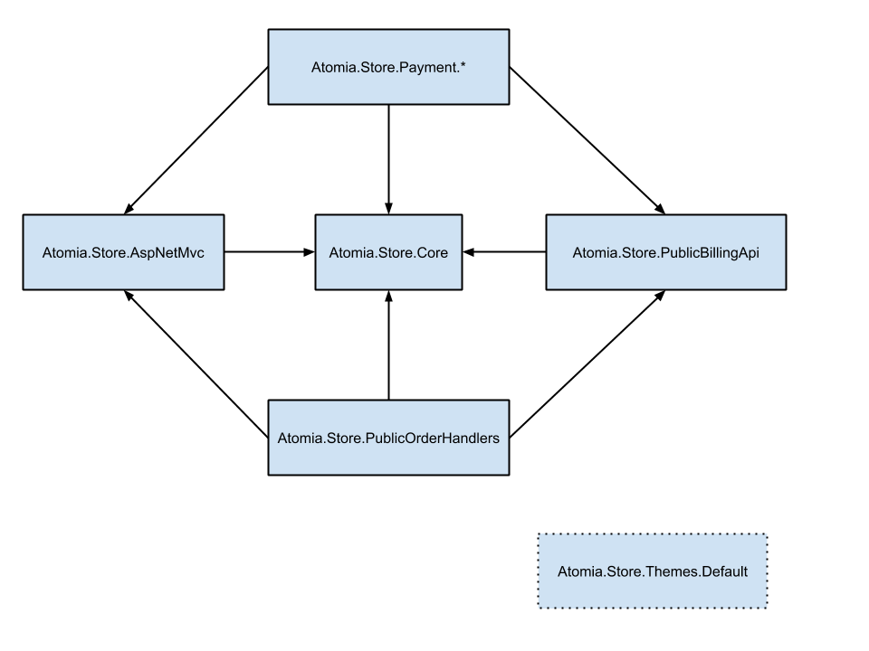

Technical Overview
==================

This article gives an overview of the implementation structure of Atomia Store and the motivation for why it is designed as it is.

It will give you some insight into the possibilities (and limitations) of customizing and extending Atomia Store, and of using Atomia Store as a framework rather than an application.

The overriding philosophy is modularization, and that parts of the application should be independently replaceable. This allows for precise customization and extension of parts of the application that need to be adapted for different use- and business cases. Keeping customizations small and precise makes maintenance easier and allows you to take advantage of fixes and product updates for the parts of Atomia Store that are kept standard.

Backend
-------

The backend is a .NET application organized around a core of domain models and abstract services located in Atomia.Store.Core. It is surrounded by two main auxilary projects Atomia.Store.AspNetMvc and Atomia.Store.PublicBillingApi, that are adapters for an ASP.NET MVC GUI and the Atomia Billing API `PublicOrderService` respectively.

* **Atomia.Store.Core** is the application core with models like `Cart`, `CartItem`, `PaymentMethod` and `Product`, and service interfaces like `IOrderPlacementService`, `IProductListProvider` and `IDomainsProvider`.
* **Atomia.Store.AspNetMvc** is an ASP.NET MVC 5 project. It wraps the domain models in ASP.NET MVC models with validation and presentational properties. It implements session-backed services like `ILanguagePreferenceProvider`, presentational services like `ICurrencyFormatter`, order flow handling, and a number of ASP.NET MVC modifications like the `RazorThemeViewEngine`.
* **Atomia.Store.PublicBillingApi** adapts the Atomia Billing API public web service to the models and services defined in Atomia.Store.Core. It has data providers like `DomainsProvider` and services like `OrderPlacementService` that encodes the expected ordering and payment logic of the Atomia Billing API.
* **Atomia.Store.Payment.*** collects in one place per payment gateway the classes for presenting payment forms and the classes used to translate collected payment data to data for the Atomia Billing API.
* **Atomia.Store.PublicOrderHandlers** isolate the implementation details of how to add specific products and other data to an order from the more detail independent Atomia.Store.PublicBillingApi.
* **Atomia.Store.Themes.Default** isolates the ASP.NET MVC view layer from Atomia.Store.AspNetMvc's models and controllers. It also contains the application root, that wires up all the concrete implementations of Atomia.Store.Core service interfaces via the Unity IoC container. (So in a 3d image it would however on top of all the other projects and have them all as dependencies.)

The purpose of this structure is to allow different parts of the application to be swapped out independently. You can see this in action in the **Atomia.Store.Fakes** project which allows you to run a development instance of Atomia Store in Visual Studio without having access to a working installation of Atomia Billing.

In the large this means that you could also for example reuse the core and GUI parts of the application and use with some other backend API for getting products and placing orders.

In a smaller example from Atomia.Store.Themes.Default we can see that the basic `DomainsProvider` from Atomia.Store.PublicBillingApi has been easily extended to mark certain configurable TLDs as premium for presentational purposes. You could easily imagine wanting some other presentational organization, or perhaps you would want to implement some sort of fuzzy keyword matching for the customer's original domain search query.

On the other end there are prepared possiblities for swapping out and amending the presentational models in the GUI (see [Customizing View Models](customizing-view-models.md).) Or, if you are feeling more adventurous, you could even use some other controller implementations or use an entirely different .NET web framework.

You can also add new payment methods and product types easily by only having to worry about the specific data needed for each new thing in isolation.

Frontend and Themes
-------------------

The frontend code of Atomia Store consists of ASP.NET MVC Razor views and knockout.js view models. It is located in the Atomia.Store.Themes.Default project.

The frontend code also adheres to the modularization principle. Each page of the application (closely matched to a step in the order flow) consists of many independent partial views with associated knockout.js view models.

More details on how the frontend is organized can be found in [Customizing Views and Layout](customizing-views-and-layout.md) and the knockout.js section of [Customizing View Models](customizing-view-models.md). 

Themes are a combination of frontend customizations, configuration customizations and any new or extended implementations of backend services.
